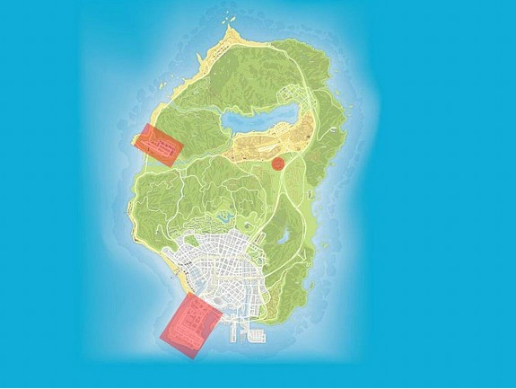

# FreeCity Roleplay Douanegebied

FreeCity kent enkele douanerisico gebieden. In een douanerisicogebied mag, in een straal van 500 meter, preventief gefouilleerd worden. Dus dat wilt zeggen dat ook voertuigen gecontroleerd mogen worden. Hier onder zijn deze gebieden aangegeven. 
De korpsleiding is bevoegd om, in samenspraak met de burgermeester van FreeCity , aanvullende douanegebieden aan te wijzen. Hiervoor gelden dezelfde regels als de normale douanerisico gebieden. 
Dit mag uitgevoerd worden door de politie,kmar en douane. 

| Locaties |
| -------- |
| Gevangenis | 
| Legerbasis | 
| LSAI Airport | 

## Kaartweergave

